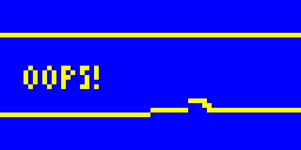
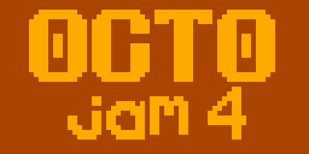
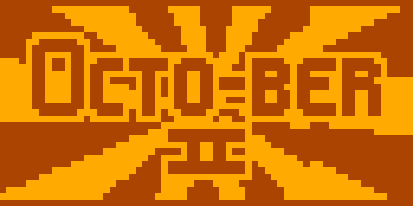

CHIP-8
========================

A CHIP-8 emulator written in C for PC.


|  |  |
| :----------: | :---------: |

*snake.ch8 by TimoTriisa*

|  |  |
| :----------: | :---------: |

*flightrunner.ch8 by TodPunk*

|  |  |
| :----------: | :---------: |

*octojam4title.ch8 and octojam2title.ch8 by JohnEarnest*

# Build from source

## Windows

Ensure CMake is installed on your system. Follow the instructions at https://cmake.org/install/.

Clone the repository and submodules:

```shell
git clone --recurse-submodules -j8 https://github.com/adelciotto/CHIP8
```

Use an IDE that supports CMake projects such as CLion or Visual Studio 2019 to compile. You can also use CMake to
generate files for your build system of choice (Ninja, Make, NMake, etc).

## OSX

These instructions assume you have Homebrew installed. If not, follow the instructions at https://brew.sh/.

Install CMake:

```shell
brew install cmake
```

Clone the repository and submodules:

```shell
git clone --recurse-submodules -j8 https://github.com/adelciotto/CHIP8
```

Generate out-of-source build files:

```shell
cd CHIP8
mkdir build && cd build
cmake .. -G "Unix Makefiles"
```

Compile the code:

```shell
make
```

You can also use CMake to generate Xcode IDE project files and compile from there if you want:

```shell
cd CHIP8
mkdir build && cd build
cmake .. -G "Xcode"
```

## Linux

These instructions assume the Ubuntu distribution and APT package manager:

```shell
sudo apt-get install cmake
```

If you want the latest version of CMake then install via the instructions at https://cmake.org/install/.

Clone the repository and submodules:

```shell
git clone --recurse-submodules -j8 https://github.com/adelciotto/CHIP8
```

Generate out-of-source build files:

```shell
cd CHIP8
mkdir build && cd build
cmake .. -G "Unix Makefiles"
```

Compile the code:

```shell
make
```

# Usage

```shell
CHIP8 --rom /path/to/rom.ch8
```

For a list of command line options and usage help:

```shell
CHIP8 --help
```

Will print:

```
./CHIP8 usage:
--help (-h): Print usage information
--fullscreen (-f): Enable fullscreen mode. Defaults to off
--rom (-r) <string>: Set the rom. Defaults to 'test_opcode.ch8'
--winscale (-w) <uint>: Set the window scale factor. Defaults to 8
--cycles (-c) <uint>: Cycles to run per tick given 60 ticks per second. Defaults to 20
--palette (-p) <string>: Set the color palette. Defaults to 'nokia'. Palettes: 'nokia','original','lcd','crt','borland','octo','gray','hotdog','cga0','cga1'
```

## Controls

### CHIP-8

```
Chip-8 Key  Keyboard
----------  ---------
1 2 3 C     1 2 3 4
4 5 6 D     q w e r
7 8 9 E     a s d f
A 0 B F     z x c v
```

### Emulator

|       Action      |   Key(s)  |
|:-----------------:|:---------:|
| Toggle Fullscreen | Alt-Enter |
| Take Screenshot   | PrtScn    |

# Resources

* http://devernay.free.fr/hacks/chip8/C8TECH10.HTM
* https://en.wikipedia.org/wiki/CHIP-8
* https://chip-8.github.io/links/
* https://github.com/JohnEarnest/Octo
